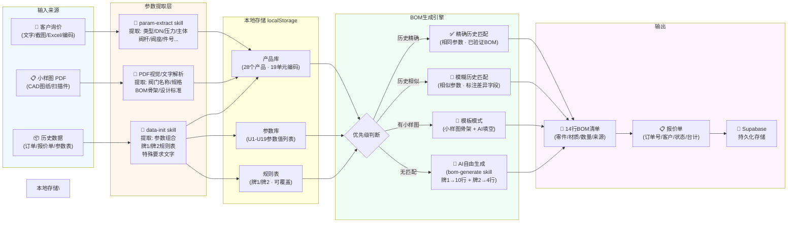
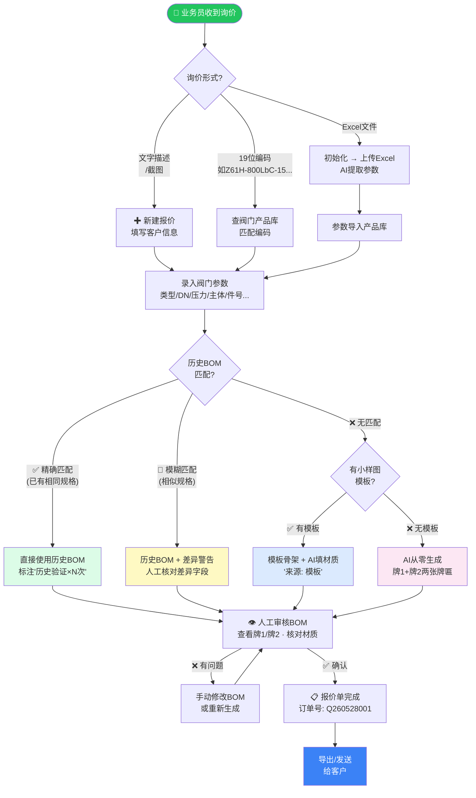
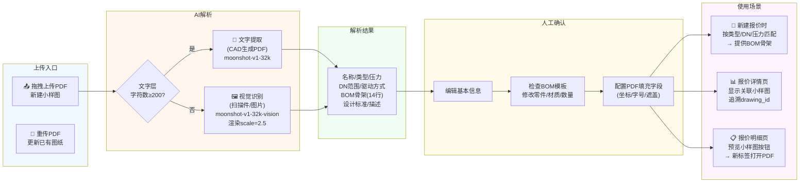
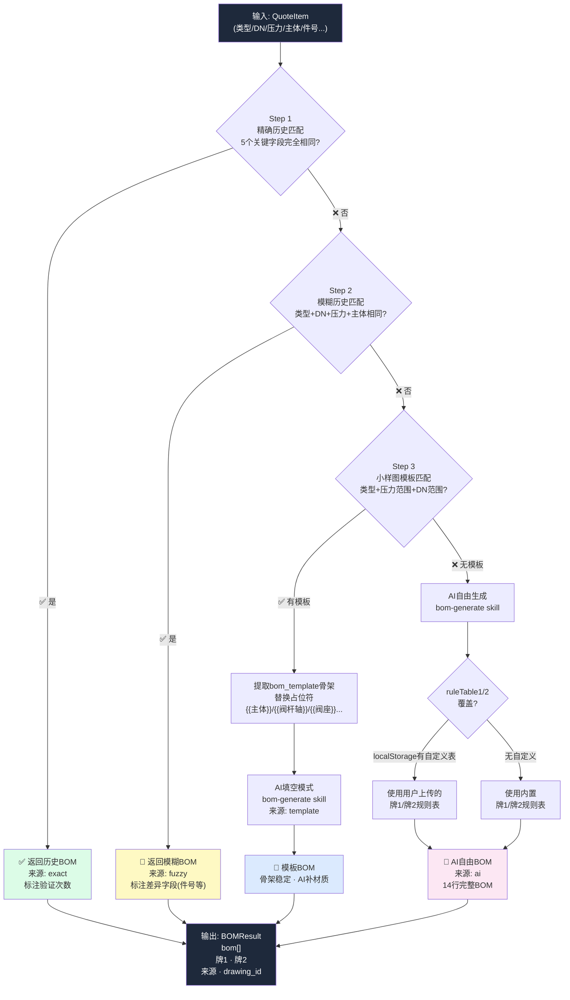

# 越强阀门 ValveQuote · 系统流程图

---

## 一、系统架构图

```mermaid
graph TB
  subgraph 浏览器 Browser
    UI["⚛️ React 19 / Next.js 16\n(单页应用 SPA)"]
    LS["💾 localStorage\n参数库 / 产品库\n规则表 / 报价缓存"]
  end

  subgraph 核心流程页面
    P1["🏠 首页 Dashboard\n指标 · 折线图 · 报价明细"]
    P2["✚ 新建报价\n参数录入 → BOM生成"]
    P3["☰ 报价单列表\n查看 · 删除 · 详情"]
    P4["≡ 报价明细\n查看BOM · 预览小样图"]
  end

  subgraph 数据管理页面
    D1["📐 小样图库\nPDF上传 · BOM模板"]
    D2["⊟ 阀门参数库\n19位编码对照表"]
    D3["⬡ 阀门产品库\n28个产品 · 19单元编码"]
    D4["◈ 参数库\nU1-U19参数值"]
    D5["☶ 规则库\n牌1+牌2材质对照表"]
    D6["⊕ 初始化\n历史数据批量导入"]
  end

  subgraph Next.js API Routes 后端
    A1["POST /api/claude\nskill路由器"]
    A2["GET/POST/PUT /api/drawings\nSELECT,INSERT,UPDATE"]
    A3["POST /api/drawings/parse\nPDF解析入口"]
    A4["POST /api/drawings/upload\n文件上传到Storage"]
    A5["GET/POST /api/quotes\n报价单CRUD"]
    A6["DELETE /api/quotes/[id]\n删除报价单"]
    A7["POST /api/init/upload\nExcel文字提取"]
  end

  subgraph AI Skills Moonshot/Kimi
    S1["📝 param-extract\n从自然语言/图片提取参数\nmoonshot-v1-32k"]
    S2["🔧 bom-generate\n两张牌匾 → 14行BOM\nmoonshot-v1-32k"]
    S3["📊 data-init\n提取参数组合/规则表\nmoonshot-v1-32k"]
    S4["🖼️ 视觉模型\nPDF图纸解析\nmoonshot-v1-32k-vision-preview"]
  end

  subgraph 数据层 Supabase
    DB1[("PostgreSQL\nquotes表\ndrawing_templates表")]
    ST1["Storage Bucket\ndrawings/\n*.pdf文件"]
  end

  UI --> P1 & P2 & P3 & P4
  UI --> D1 & D2 & D3 & D4 & D5 & D6
  UI <--> LS

  P2 --> A1 --> S1 & S2
  D1 --> A3 --> S4
  D3 --> A1 --> S3
  D6 --> A7

  A2 <--> DB1
  A3 --> A4 --> ST1
  A4 --> DB1
  A5 <--> DB1
  A6 --> DB1

  style 浏览器\ Browser fill:#f0f9ff,stroke:#0ea5e9
  style 核心流程页面 fill:#f0fdf4,stroke:#22c55e
  style 数据管理页面 fill:#fefce8,stroke:#eab308
  style Next.js\ API\ Routes\ 后端 fill:#faf5ff,stroke:#a855f7
  style AI\ Skills\ Moonshot/Kimi fill:#fff7ed,stroke:#f97316
  style 数据层\ Supabase fill:#fdf2f8,stroke:#ec4899
```

---

## 二、数据流图



---

## 三、日常操作流程



---

## 四、小样图管理流程



---

## 五、BOM生成决策树


