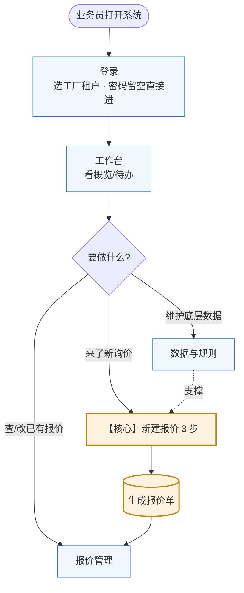
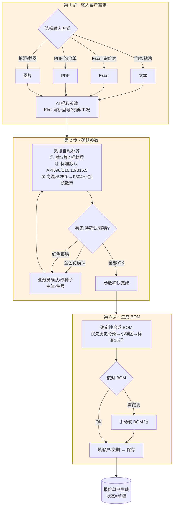
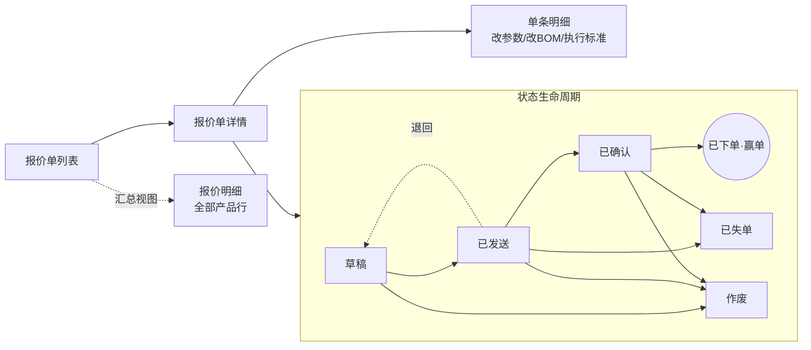
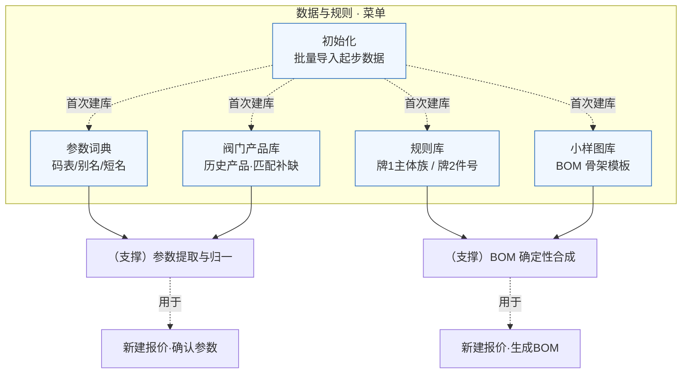
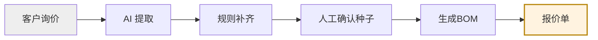

# 越强阀门 · 智能报价系统 — 产品使用流程图

> 面向业务员：从登录到出报价单的完整路径。核心是「**新建报价**」三步走，其余是支撑与管理。

---

## 一、总览：怎么用这个系统

---

## 二、核心流程：新建报价（3 步）

**关键提示**：第 2 步大部分字段由规则自动填（蓝色"规则"标），业务员通常只需拍板 **主体 + 件号** 两个种子，其余联动重算。工况（温度/加长/散热片）会进「特殊」框，不丢失。

---

## 三、报价管理与状态流转

---

## 四、数据与规则（支撑核心流程，一次配置长期复用）

---

## 五、一句话总结

> **AI 认参数 + 规则补全 + 人工只拍板关键种子** —— 把"老师傅脑子里的报价经验"沉淀成系统。
