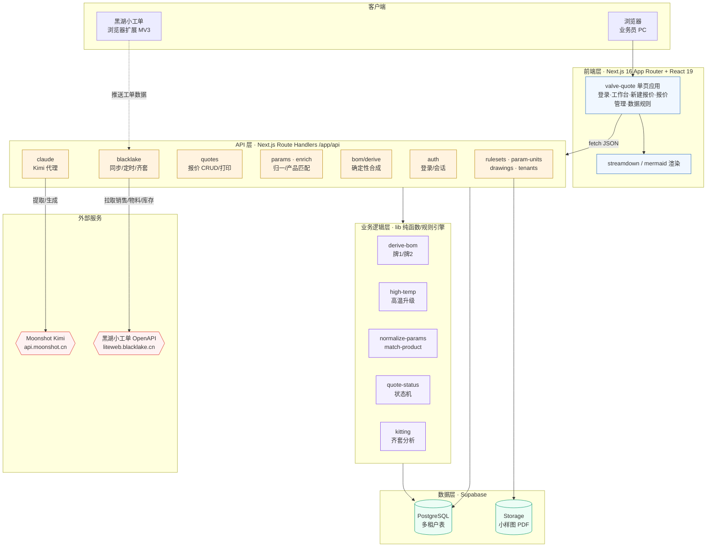
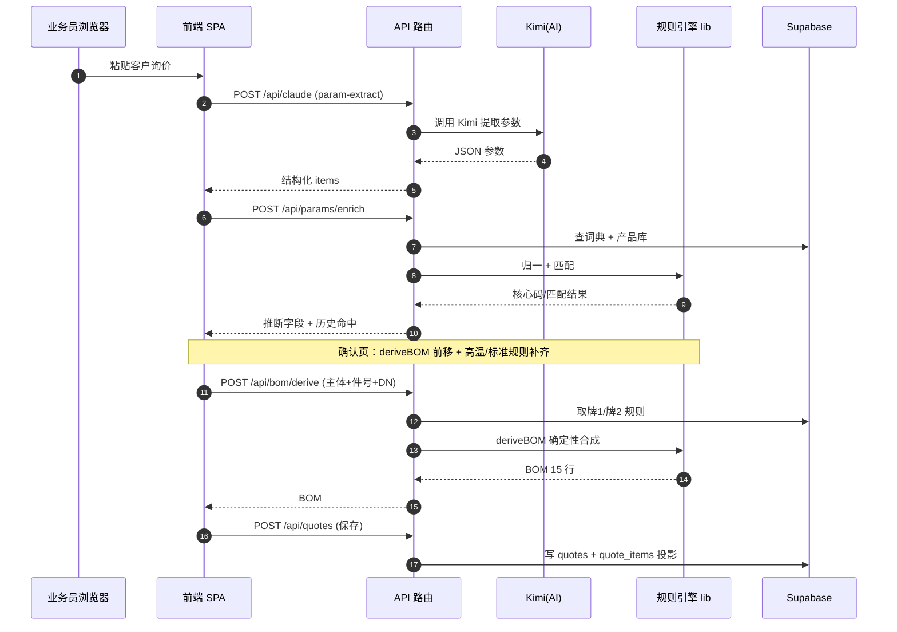
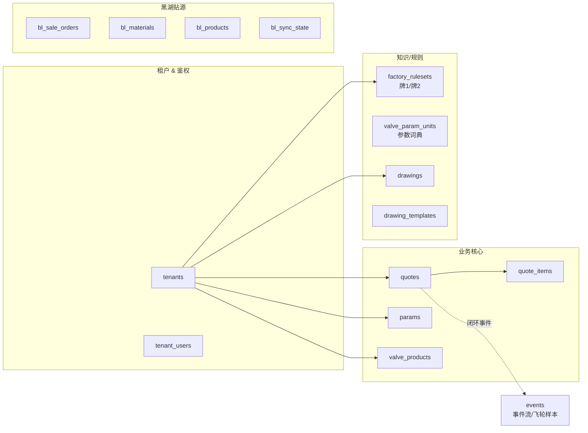

# 越强阀门 · 智能报价系统 — 技术架构图

> 技术视角：浏览器 → Next.js 前端 → API 路由 → 业务规则引擎 → Supabase 数据层，外接 Kimi(AI) 与黑湖(ERP)。

---

## 一、分层架构总览

---

## 二、核心数据流：一次报价的请求链路

---

## 三、数据表全景（Supabase / 多租户，按 tenant_id 隔离）

---

## 四、技术栈要点

| 层 | 技术 |
|---|---|
| 前端 | Next.js 16 (App Router, Turbopack) · React 19 · Zustand · SWR · Tailwind v4 |
| API | Next.js Route Handlers（同仓 BFF，服务端直连 DB） |
| 鉴权 | 签名 Cookie 会话（Node crypto，零依赖）· 多租户按 tenant_id 隔离 |
| AI | Moonshot Kimi（`moonshot-v1-32k` / vision），prompt 在 `app/api/claude/skills/*.md` |
| 规则引擎 | `lib/*` 纯函数：deriveBOM(牌1/牌2)、high-temp、normalize、match —— 可单测、零幻觉 |
| 数据 | Supabase（PostgreSQL + Storage） |
| 集成 | 黑湖小工单 OpenAPI（销售/物料/库存增量同步）+ 浏览器扩展 |

> 设计要点：**AI 只做"模糊提取"，确定性规则做"补齐与校验"**——把易错的材质/BOM 推导从 LLM 挪到纯函数，准确率与可维护性都更高。
